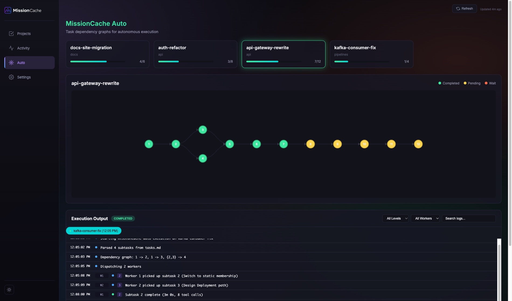
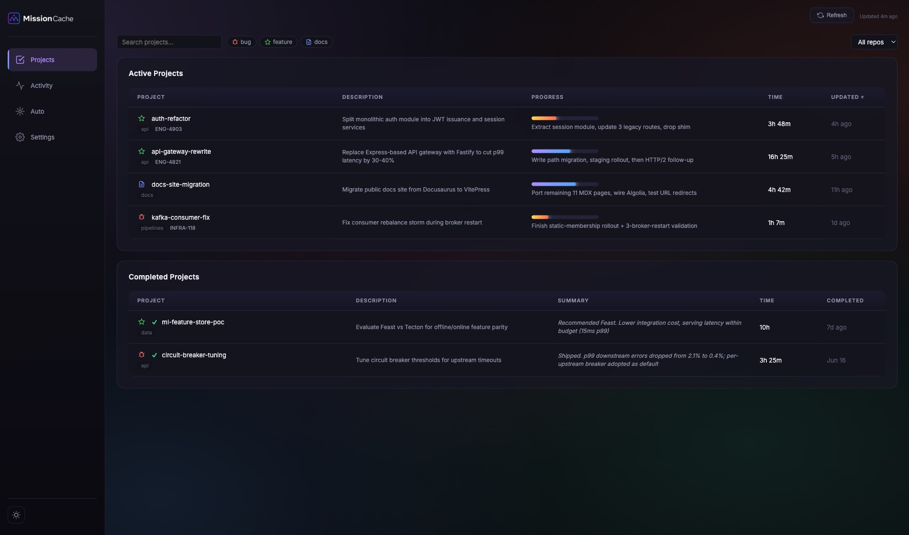
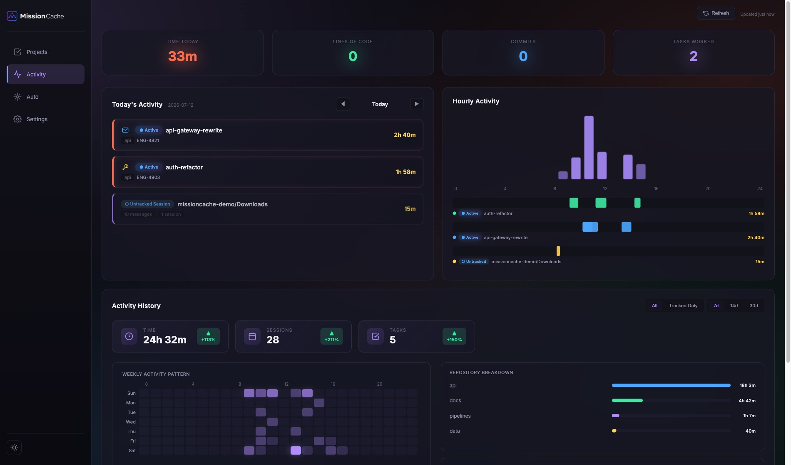
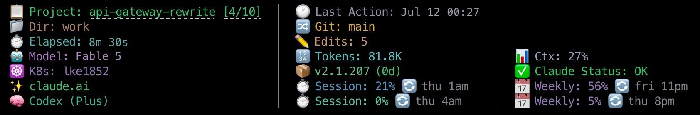

<p align="center">
  <picture>
    <source media="(prefers-color-scheme: dark)" srcset="assets/missioncache_logo_white.png">
    <source media="(prefers-color-scheme: light)" srcset="assets/missioncache_logo_black.png">
    
  </picture>
</p>

<h1 align="center">MissionCache</h1>

<p align="center"><strong>One workbench for your AI coding projects.</strong></p>

<p align="center"><em>Plan, execute, track, and resume - without losing state.</em></p>

<p align="center">
  
  
  
</p>

---

MissionCache is the project layer for AI coding tools. It works in [Claude Code](https://claude.ai/code), [Codex](https://github.com/openai/codex), [OpenCode](https://opencode.ai/), and VSCode Copilot Chat - any tool that speaks MCP. Every missioncache project gets a durable home: a plan, a living context file, and a task checklist. That state persists across sessions, survives context compaction, and reloads when you come back. On the Claude Code side, missioncache also adds time tracking, a local analytics dashboard, autonomous execution, and a rich statusline; the other three currently get the project state and the MCP tool suite.

<!-- HERO GIF: dashboard + statusline + /missioncache:new flow -->

## Contents

- [Why MissionCache](#why-missioncache)
- [Supported tools](#supported-tools)
- [Install](#install)
- [Upgrading](#upgrading)
- [Your First Project](#your-first-project)
- [Features](#features)
- [How MissionCache compares](#how-missioncache-compares)
- [Architecture](#architecture)
- [Commands](#commands)
- [Documentation](#documentation)
- [Contributing](#contributing)
- [License](#license)
- [Credits](#credits)

## Why MissionCache

### Your projects keep their memory

Every missioncache project lives under `~/.missioncache/active/<project-name>/` as three markdown files: `plan.md` (the agreed approach, locked after approval), `context.md` (your decisions, key files, gotchas, and next steps as a living document), and `tasks.md` (a hierarchical checklist with progress). Sessions end, context windows compact, but your project state stays put. Run `/missioncache:load <project-name>` in any new Claude Code session (or `/missioncache-load` in Codex, OpenCode, or VSCode) and missioncache reloads the full state. You pick up where you left off with your plan, your decisions, and your next steps already loaded.

### Full visibility into your Claude time

MissionCache tracks heartbeats while you work, aggregates them into sessions, and shows per-project, per-repo, per-day, and per-week breakdowns on a local web dashboard at `localhost:8787`. It merges missioncache's own heartbeat data with Claude Code's JSONL session logs, so the picture includes time you spent in Claude sessions that were not formally tracked. You always know which projects are actually eating your cycles.

### Autonomous execution you can watch live

MissionCache Auto runs project tasks in parallel with dependency-aware DAG scheduling, logs every iteration in real time, and streams execution state to the dashboard. You can watch the whole run as it happens or walk away and check the iteration log afterward. Every task, every attempt, every outcome is visible.

---

MissionCache exists because no single existing tool integrates all three. See [How MissionCache compares](#how-missioncache-compares) for the honest breakdown against the current field.

## Supported tools

MissionCache's MCP server and slash commands install into any of the major AI coding tools. The full installer detects which tools you have and asks per-tool whether to register MissionCache. Each prompt installs both the MCP server and the slash commands together; the CLI offers `--no-codex-commands` (and `--no-opencode-commands` / `--no-vscode-commands`) if you want MCP without slash commands.

| Tool | MCP server | Slash commands | Invocation | Hooks / statusline / missioncache-auto |
|------|------------|----------------|------------|----------------------------------------|
| Claude Code | yes | yes | `/missioncache:load`, `/missioncache:save`, ... | yes (full) |
| Codex CLI | yes | yes | `/missioncache-load`, `/missioncache-save`, ... | not yet |
| OpenCode | yes | yes | `/missioncache-load`, `/missioncache-save`, ... | not yet |
| VSCode (Copilot Chat) | yes | yes (macOS) | `/missioncache-load`, `/missioncache-save`, ... | n/a (editor-level) |

Claude commands use `:` namespacing because Claude's plugin system auto-prefixes plugin commands. The other three tools have flat slash-command namespaces, so missioncache's commands ship as `missioncache-load.md` etc. and resolve to `/missioncache-load`. The behavior is identical across tools - only the invocation token differs by one character.

Per-tool registration details:

- **Codex** - registered as a real plugin via `codex plugin marketplace add ~/.missioncache/codex-marketplace`. The `[plugins."missioncache@missioncache"]` stanza lands in `~/.codex/config.toml`. Restart Codex to load the commands.
- **OpenCode** - markdown commands written directly to `~/.config/opencode/commands/`. Picked up immediately, no restart needed.
- **VSCode** - prompt files written to `~/.missioncache/vscode/prompts/` and registered in user `settings.json` via `chat.promptFilesLocations`. Available across every workspace, no per-repo opt-in required. macOS only for now (Linux/Windows VSCode app detection deferred).

Per-tool hooks, statuslines, and `missioncache-auto` integration stay Claude-only for this release - tracked as a follow-up phase post-launch.

## Install

MissionCache ships in two flavors. Pick based on whether you want the full workbench experience (recommended) or just the plugin core.

### Full install (recommended)

One command, no clone needed:

```bash
uvx missioncache-install
# or
pipx run missioncache-install
```

The interactive wizard asks which components to install (default is all) and sets up:

1. The missioncache plugin itself (slash commands, MCP server, hooks, rules)
2. The local dashboard at `localhost:8787` as a background service (launchd on macOS, systemd on Linux)
3. The `missioncache-auto` CLI for autonomous execution
4. The `missioncache-statusline` entry point, wired into `~/.claude/settings.json`
5. MissionCache rule files under `~/.claude/rules/`
6. The `/whats-new` and `/optimize-prompt` user-level slash commands under `~/.claude/commands/`

For a fully non-interactive install, use `uvx missioncache-install --all --yes`. To install everything except specific components, combine `--all` with opt-outs (e.g. `uvx missioncache-install --all --yes --no-statusline`). Opt-out flags on their own drop you into the interactive wizard; they only take effect alongside `--all` or explicit opt-ins.

**Requirements:** Python 3.11+, Claude Code CLI, and `uv` on your `PATH` (provides `uvx`). If `uvx --version` fails, install `uv` first with `pip install uv` or `curl -LsSf https://astral.sh/uv/install.sh | sh`. `pipx` works in place of `uvx` if you prefer.

**Windows note:** Windows service registration is not yet supported - the installer still registers the plugin, pip-installs `missioncache-auto`, and prints manual instructions for running the dashboard.

### Plugin-only install

If you only want the plugin core (slash commands, MCP tools, lifecycle hooks, missioncache rules) and don't need the dashboard, `missioncache-auto` CLI, or statusline, install MissionCache as a pure Claude Code plugin via the marketplace.

In Claude Code:

```
/plugin marketplace add missioncache/missioncache
/plugin install missioncache@missioncache
```

Restart your Claude Code session.

**Requirements:** Claude Code with `uvx` available on `PATH`. If `uvx --version` fails, install `uv` first with `pip install uv` or `curl -LsSf https://astral.sh/uv/install.sh | sh`. The MCP server and bundled `missioncache-db` are built on demand; no manual `pip install` is needed.

**What you give up with the plugin-only install:** no local dashboard at `localhost:8787`, no `missioncache-auto` CLI for parallel execution, no rich statusline. You keep everything else: per-project plan/context/tasks files, `/missioncache:load` resume, time heartbeat tracking in `~/.missioncache/tasks.db`, and all 30+ MCP tools.

### Other tools (Codex, OpenCode, VSCode)

The full installer also registers missioncache in any non-Claude tool it detects. See [Supported tools](#supported-tools) above for the per-tool registration mechanics. The MCP server and slash commands are the same files missioncache ships to Claude; only the invocation token (`/missioncache:load` vs `/missioncache-load`) differs.

## Upgrading

### Full install

Re-run the installer to refresh every component to the latest published version:

```bash
uvx missioncache-install --update
```

This pulls the latest `missioncache-dashboard` and `missioncache-auto` from PyPI for the components you originally installed, restarts the dashboard service, and reinstalls the Claude Code plugin. The MCP server (`mcp-missioncache`) runs through `uvx --from ${CLAUDE_PLUGIN_ROOT}/mcp-server`, so it refreshes from whatever the plugin marketplace pulled in. Run `/plugin update missioncache@missioncache` in Claude Code (or `claude plugins install missioncache@local` for maintainers) if you want to force a plugin-cache refresh. Restart your Claude Code session to pick up the new plugin code. `missioncache-db` is a transitive dependency of `missioncache-dashboard` and `missioncache-auto`, so it refreshes alongside them.

If the `uvx` cache is pinning you to an older `missioncache-install` itself, clear it with `uvx cache prune` or `uvx --refresh missioncache-install --update`.

### Plugin-only install

From Claude Code:

```
/plugin update missioncache@missioncache
```

Restart your Claude Code session.

### Maintainer install (editable from a clone)

If you are developing on missioncache rather than consuming it, see [CONTRIBUTING.md](CONTRIBUTING.md) for the `uvx missioncache-install --local` workflow. A `git pull` picks up changes in the editable Python packages; you still need `claude plugins install missioncache@local` for plugin-cache refreshes and a service restart for dashboard server-code changes.

## Your First Project

### Create it

```
/missioncache:new auth-refactor
```

MissionCache drops three files under `~/.missioncache/active/auth-refactor/`:

```
auth-refactor-plan.md      # the agreed approach, locked after you approve
auth-refactor-context.md   # living notes: decisions, key files, gotchas, next steps
auth-refactor-tasks.md     # checklist with hierarchical subtasks
```

Claude walks you through a clarifying conversation, proposes a plan, and asks for approval. Once approved, the plan file is locked and the context file starts tracking your real progress.

<!-- SCREENSHOT: /missioncache:new interactive flow with file tree -->

### Work on it

Edit files, run tests, make decisions. MissionCache tracks time in the background via heartbeats. When Claude Code compacts the context window, missioncache's `PreCompact` hook auto-saves your current state so nothing gets lost.

If you want to checkpoint manually at any point:

```
/missioncache:save
```

### Resume it tomorrow

```
/missioncache:load auth-refactor
```

MissionCache reloads the plan, context, and tasks files and shows you:

- Where you left off (from the context file's "Next Steps" section)
- Progress (X/Y tasks complete)
- Key architectural decisions you made
- Any gotchas you flagged

You pick up without reconstructing anything.

<!-- SCREENSHOT: /missioncache:load output showing reload summary -->

### Run it autonomously

*Requires the full install (`uvx missioncache-install`). If you picked the plugin-only install, skip to "Finish it".*

If your tasks are decomposed enough, hand the whole project to MissionCache Auto:

```bash
missioncache-auto auth-refactor              # parallel, 8 workers (default)
missioncache-auto auth-refactor -w 12        # 12 workers
missioncache-auto auth-refactor --sequential # one task at a time
missioncache-auto auth-refactor --dry-run    # show execution plan without running
```

Auto runs each task in a separate Claude Code invocation, respects task dependencies, and streams iteration events to the dashboard. On a git repo, parallel runs give each worker its own git worktree and branch by default (merged back when the run finishes); pass `--no-worktree` to share one checkout.



### Finish it

```
/missioncache:done auth-refactor
```

MissionCache archives the project files to `~/.missioncache/completed/` and records the final time and progress stats.

That is the full lifecycle. Everything else is optional depth.

## Features

### Structured project files

Every project has three markdown files: `plan`, `context`, and `tasks`. They live under `~/.missioncache/active/<project-name>/` and are fully human-editable. Plan captures the agreed approach and locks after approval. Context is a living document for decisions, key files, gotchas, and next steps. Tasks is a hierarchical checklist with per-item progress tracking.

<!-- SCREENSHOT: example tasks.md with checkboxes and phases -->

### Context preservation across compaction

MissionCache's `PreCompact` hook auto-saves project state before Claude Code compacts the context window. When you run `/missioncache:load` in a new session, the full state reloads. You never reconstruct your mental model from scratch, and you never lose a decision you made three sessions ago.

### Local analytics dashboard

A FastAPI + vanilla JS single-page app at `localhost:8787`. Shows active and completed projects with time tracking, per-repo breakdowns, hourly heatmaps, a weekly activity view, MissionCache Auto execution monitoring with DAG visualization, and untracked Claude Code sessions alongside the tracked ones. Dual-database under the hood: SQLite for writes, DuckDB for analytics reads.





### Autonomous execution with MissionCache Auto

A standalone CLI that runs a project's tasks to completion in parallel. DAG scheduling respects task dependencies so dependent work waits for its prerequisites. Default eight workers, configurable with `-w N` or `--sequential`. Every iteration is logged with a timestamp, the task, the agent that ran it, and the outcome, and streamed live to the dashboard.


### Rich multi-line statusline

An optional terminal display showing the active project with progress fraction, git branch and status, Claude model, context usage, API limits, and last action time. OSC 8 hyperlinks open directly into the dashboard's project view from your terminal. Configurable, dark-mode friendly, low-latency.



### A full MCP tool suite for Claude

MissionCache's MCP server exposes tools across five categories: task lifecycle, file operations, time tracking, iteration logging, and repository management. Claude uses them automatically during `/missioncache:new`, `/missioncache:load`, and other commands, but you can call any of them directly if you want fine-grained control.

### Lifecycle hooks

Five Claude Code hooks across four events tie missioncache directly into the session lifecycle, and they are what makes "resume tomorrow" actually work. `SessionStart` auto-detects the active project as soon as you open a terminal. `PreCompact` auto-saves your context before Claude Code compacts the window, so nothing gets lost on long sessions. `Stop` reminds you to run `/missioncache:save` if you edited project files without saving. Two `UserPromptSubmit` hooks run on every prompt: one records the activity heartbeats that power time tracking, the other reminds you when task tracking drifts. All five ship with the plugin.

## How MissionCache compares

MissionCache sits at the intersection of three categories that usually ship as separate tools: task management, context preservation, and execution with analytics. Here is an honest look at how missioncache stacks up against the current field, grouped by category so you can jump to the tool you already know.

### vs. Task and project management

For readers who know the Anthropic Productivity Plugin or [Taskmaster AI](https://github.com/eyaltoledano/claude-task-master):

| Capability | MissionCache | Productivity Plugin | Taskmaster AI |
|---|---|---|---|
| Auto task decomposition from PRD | manual (Claude-assisted) | manual | yes (dependency-aware) |
| Plan + context + tasks files per project | yes | partial (tasks only) | no |
| Resume project across sessions | yes (`/missioncache:load`) | yes (workplace memory) | yes (file-based JSON) |
| Time tracking per task | yes (heartbeats) | no | no |
| Local dashboard | yes (web, analytics) | yes (HTML Kanban) | no |
| Autonomous execution | yes (missioncache-auto) | no | no |
| Build/test gates on task close | no | no | yes |
| Multi-IDE support | Claude Code, Codex, OpenCode, VSCode (MCP) | Cowork-first | 13 IDEs |
| License | MIT | Anthropic official | MIT + Commons Clause |

**Honest takeaway:** Taskmaster is stronger at PRD decomposition and at working across multiple IDEs. The Productivity Plugin is the simplest official option, with a Kanban board and workplace memory, and it ships from Anthropic. MissionCache is the only one of the three with per-project time tracking, a local analytics dashboard, and autonomous execution in the same tool.

### vs. Memory and context preservation

For readers who know [claude-mem](https://github.com/thedotmack/claude-mem) or [MemPalace](https://www.mempalace.tech/):

| Capability | MissionCache | claude-mem | MemPalace |
|---|---|---|---|
| Unit of organization | Projects | Sessions, entities | Wings, rooms (domains) |
| Capture mode | On compaction + `/missioncache:save` | Auto per session | Auto every 15 messages |
| Storage | Human-editable markdown | AI-compressed, vector search | Structured memory palace |
| Project-scoped state | yes (plan, context, tasks) | partial | partial (wings can be projects) |
| Task checklists with progress | yes | no | no |
| Time tracking | yes | no | no |
| Dashboard | yes | partial (web viewer) | no |
| Autonomous execution | yes | no | no |
| Cross-domain recall across projects | partial | yes | yes (by design) |

**Honest takeaway:** claude-mem and MemPalace are genuinely better than missioncache at cross-project memory recall. They auto-capture and query across everything you have ever worked on. MissionCache is better at project-scoped state: what is the plan for *this* project, what have I decided, what is the task list, how much time have I spent, what is next. You can reasonably run missioncache alongside a memory layer: MemPalace or claude-mem for long-term cross-project recall, missioncache for the project you are actively building.

### vs. Execution and methodology frameworks

For readers who know [GSD](https://github.com/gsd-build/get-shit-done) or [Superpowers](https://github.com/obra/superpowers):

| Capability | MissionCache | GSD (v2) | Superpowers |
|---|---|---|---|
| What it is | Project system | Autonomous execution CLI | Methodology / skills framework |
| Prescribes a methodology | no (flexible) | yes (spec, research, execute) | yes (7 phases, TDD enforced) |
| Autonomous execution | yes (DAG, parallel) | yes (sequential phases) | partial (native Task tool only) |
| Context preservation across sessions | yes (plan/context/tasks files) | partial (fresh context per task) | no |
| Time tracking | yes (per project) | partial (cost and token tracking) | no |
| Dashboard | yes | no | no |
| Statusline integration | yes | no | no |
| Token efficiency | moderate | low (fresh 200K context per task) | low (around 10x Plan mode per HN reports) |
| Composable with missioncache | N/A | conflicts (both own execution) | yes (Superpowers skills inside a missioncache project) |

**Honest takeaway:** GSD pioneered the "fresh context per task" pattern and remains the reference for aggressive context-rot elimination. Superpowers is a methodology, not a system, and it **composes with missioncache**: you can use Superpowers skills inside a missioncache-managed project to get TDD enforcement and structured planning on top of missioncache's project state and time tracking. MissionCache's unique contribution is integrating autonomous execution with persistent project state and analytics in a single tool.

### vs. native Claude Code features

For readers coming from [Claude Code Agent Teams](https://code.claude.com/docs/en/agent-teams), the native statusline, or Claude's built-in analytics:

| Capability | MissionCache | Agent Teams | Native Statusline | Native Analytics |
|---|---|---|---|---|
| Status | Stable | Experimental (v2.1.32+) | Stable | GA (Teams / Enterprise) |
| Zero install | no (plugin) | yes | yes | yes |
| Persistent project state between invocations | yes (plan, context, tasks files) | no | N/A | no |
| Task list with dependencies | yes (DAG-scheduled) | yes (flat, shared) | N/A | no |
| Multi-session orchestration | missioncache-auto (parallel, DAG) | yes (2 to 16 sessions) | N/A | no |
| Time tracking per project | yes (heartbeats, JSONL merge) | no | no | no (contribution metrics only) |
| Local dashboard with analytics | yes | no | N/A | cloud-only |
| Project-aware statusline | yes (OSC 8 deep links into dashboard) | no | generic (model, tokens, git) | N/A |
| Self-hosted | yes | yes | yes | no |
| Available to individual users | yes | yes | yes | Teams / Enterprise plans only |

**Honest takeaway:** Agent Teams is the most direct native competitor for the "run Claude autonomously across multiple sessions" use case. Its strengths are zero install and improving with every Claude Code release - that is a real risk to missioncache over time. Its current limits: it is still experimental, it has no persistent state between invocations, no dashboard, no time tracking, no per-task analytics, and a 16-session ceiling. Native analytics is GitHub-scoped, cloud-hosted, and only on paid Teams or Enterprise plans. MissionCache's statusline is project-aware with OSC 8 deep links into the local dashboard; the native statusline is a generic token/model/git display. Today missioncache wins on persistence, analytics, and the integrated experience. If Agent Teams adds persistent state and a dashboard, that story gets harder - tracked as a known long-term risk.

### When to use something else

MissionCache is not the right answer for every workflow. Use one of these instead if:

- **You want PRD to task decomposition with multi-IDE support:** [Taskmaster AI](https://github.com/eyaltoledano/claude-task-master)
- **You want a methodology that enforces TDD and structured planning:** [Superpowers](https://github.com/obra/superpowers) (and you can use it alongside missioncache)
- **You want cross-domain memory that outlives any single project:** [MemPalace](https://www.mempalace.tech/) or [claude-mem](https://github.com/thedotmack/claude-mem)
- **You want aggressive context-rot elimination with fresh contexts per task:** [GSD / GSD-2](https://github.com/gsd-build/get-shit-done)
- **You want Anthropic's official Kanban and workplace memory with zero setup:** [Productivity Plugin](https://claude.com/plugins/productivity)
- **You want zero-install native multi-session orchestration with no persistent state between runs:** [Claude Code Agent Teams](https://code.claude.com/docs/en/agent-teams) (experimental, ships with Claude Code)
- **You want all of the above integrated into one workbench for a specific project:** MissionCache

## Architecture

MissionCache's load-bearing piece is the `mcp-missioncache` MCP server. Around it sit four standalone components you can install or skip independently:

| Component | Purpose | Installs via |
|---|---|---|
| `mcp-missioncache` | MCP server (project state, file ops, time tracking, iteration logging) | Bundled with the Claude plugin; `pipx install mcp-missioncache` for other tools |
| `missioncache` Claude plugin | Slash commands as `/missioncache:*`, lifecycle hooks (SessionStart, PreCompact, Stop, UserPromptSubmit), rules | Claude Code plugin marketplace |
| `missioncache-db` | SQLite layer at `~/.missioncache/tasks.db` | `pip install missioncache-db` |
| `missioncache-auto` | Autonomous execution CLI (Claude Code only) | `pip install missioncache-auto` |
| `missioncache-dashboard` | Local FastAPI + vanilla JS web UI at `localhost:8787`, DuckDB analytics layer (Claude Code only) | Runs as a launchd/systemd service |
| `missioncache-statusline` | Optional multi-line terminal display (Claude Code only) | Bundled with `missioncache-dashboard`, wired into `~/.claude/settings.json` |

<!-- DIAGRAM: plugin + MCP server + db + auto + dashboard + statusline component graph -->

The MCP server plus `missioncache-db` is the minimum viable install (and the only piece needed for Codex / OpenCode / VSCode). Everything else is opt-in, and each component can be used on its own if you only need that piece. `missioncache-db` and `missioncache-auto` are pip-installable packages you can depend on from your own scripts.

### Data storage

| Path | Purpose |
|---|---|
| `~/.missioncache/active/` | Active project files (plan, context, tasks) |
| `~/.missioncache/completed/` | Archived completed projects |
| `~/.missioncache/tasks.db` | SQLite database (task tracking, time heartbeats, Claude session cache) |
| `~/.missioncache/tasks.duckdb` | DuckDB analytics (synced from SQLite, dashboard reads) |

## Commands

| Command | Description |
|---------|-------------|
| `/missioncache:new` | Create a new project with plan, context, and task files |
| `/missioncache:load` | Resume work on an active project |
| `/missioncache:save` | Persist progress before session end or compaction |
| `/missioncache:done` | Mark a project as completed and archive |
| `/missioncache:prompts` | Regenerate optimized prompts for subtasks |
| `/missioncache:mode` | Assign workflow mode (interactive or autonomous) to tasks |

## Documentation

Deep dives for each component live in `docs/`:

- [**Installation**](docs/installation.md) - all three install paths (`uvx missioncache-install`, marketplace, manual), verification, uninstall, troubleshooting
- [**Architecture**](docs/architecture.md) - component boundaries, database schema, extension points
- [**Dashboard**](docs/dashboard.md) - screens, time accounting, API reference, customization
- [**MissionCache Auto**](docs/missioncache-auto.md) - sequential vs parallel, DAG scheduling, learning tags, worker model, review stages
- [**MCP Tools**](docs/mcp-tools.md) - all 36 tools by module, error handling, extension patterns
- [**CLI**](docs/cli.md) - the CLI-only operations: cross-machine export/import with the per-machine path map, tag keywords, prune/cleanup, bulk repo registration
- [**Statusline**](docs/statusline.md) - lines explained, env vars, customization, performance notes
- [**Hooks**](docs/hooks.md) - SessionStart, UserPromptSubmit, PreCompact, Stop, state files, adding new hooks

## Contributing

Pull requests welcome. See [CONTRIBUTING.md](CONTRIBUTING.md) for development setup (`uvx missioncache-install --local`), testing conventions, and PR standards.

## License

MIT. See [`LICENSE`](LICENSE).

## Credits

MissionCache stands on the shoulders of the tools that came before it. Direct inspiration and honest competition: [GSD](https://github.com/gsd-build/get-shit-done), [claude-mem](https://github.com/thedotmack/claude-mem), [MemPalace](https://www.mempalace.tech/), [Taskmaster AI](https://github.com/eyaltoledano/claude-task-master), [Superpowers](https://github.com/obra/superpowers), and the [Anthropic Productivity Plugin](https://claude.com/plugins/productivity). Each of them solves a real slice of the multi-session Claude Code problem, and missioncache would not exist without the paths they blazed.
