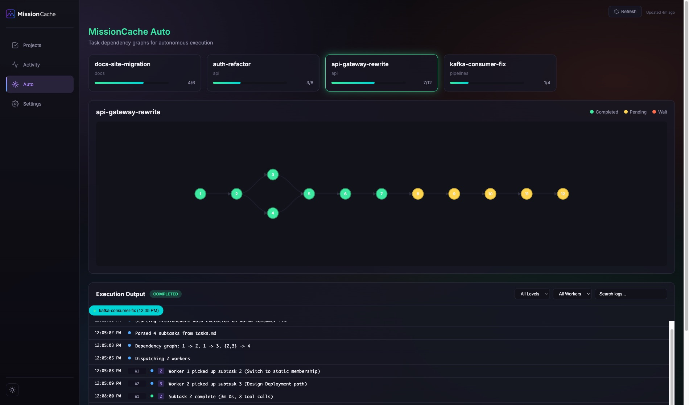
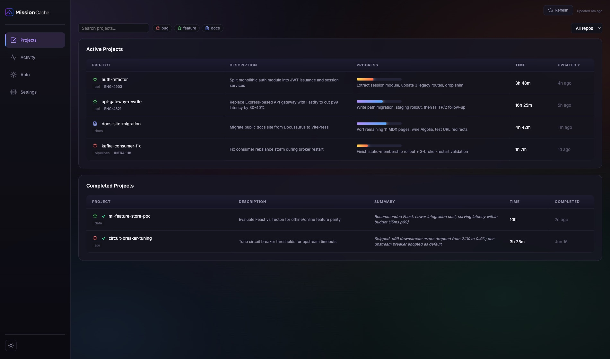

<p align="center">
  <picture>
    <source media="(prefers-color-scheme: dark)" srcset="assets/missioncache_logo_white.png">
    <source media="(prefers-color-scheme: light)" srcset="assets/missioncache_logo_black.png">
    
  </picture>
</p>

<h1 align="center">MissionCache</h1>

<p align="center"><strong>Every session remembers. One session watches.</strong></p>

<p align="center"><em>Run many AI coding sessions without losing the thread.</em></p>

<p align="center">
  
  
  
</p>

---

MissionCache gives every AI coding project a memory that survives compaction: the plan, the decisions, the gotchas, what is left. It lives in three markdown files per project, and it reloads with one command in the next session, or in another tool.

When you run several sessions at once, one of them can be the **lead**. It hears from all the others, so you watch one window instead of five.

It works in Claude Code, Codex, OpenCode and VSCode. Claude Code also gets time tracking, a local dashboard, a rich statusline and autonomous runs. It runs on your machine and needs [`uv`](https://docs.astral.sh/uv/), so it does not work in claude.ai chat.

## Contents

- [Why MissionCache](#why-missioncache)
- [Supported tools](#supported-tools)
- [Install](#install)
- [Your First Project](#your-first-project)
- [Features](#features)
- [When to use something else](#when-to-use-something-else)
- [Architecture](#architecture)
- [Commands](#commands)
- [Documentation](#documentation)
- [Contributing](#contributing)
- [License](#license)
- [Credits](#credits)

## Why MissionCache

- **Your project keeps its memory.** Sessions end and context windows compact, and every compaction summary drops details, like a constraint or a "don't do X". Anthropic calls this [goal drift](https://claude.dev/blog/a-harness-for-every-task-dynamic-workflows-in-claude-code/). The plan, your decisions and the next step stay in files, and `/missioncache:load` brings them back.
- **One session keeps the others in view.** `/missioncache:lead` makes one session the lead, and `/missioncache:unlead` ends the role. Every other session tells it when its project changes.
- **You see where the time went.** A local dashboard shows hours per project, per repo and per day, including Claude Code sessions outside any project.
- **Tasks can run on their own.** `missioncache-auto` runs a project's tasks in parallel, in dependency order, and you can watch it live.

No other single tool does all four. [docs/comparison.md](docs/comparison.md) has the honest comparison.

## Supported tools

The installer detects the AI tools you have and asks, per tool, whether to register MissionCache. The project files, the MCP server and the commands are the same everywhere. Only the way you type a command differs.

| Tool | Project files + MCP tools | Commands | Lead, hooks, statusline, dashboard, auto |
|------|---------------------------|----------|------------------------------------------|
| Claude Code | yes | `/missioncache:load`, `/missioncache:save`, ... | yes |
| Codex CLI | yes | `$missioncache-load`, `$missioncache-save`, ... (native skills) | no |
| OpenCode | yes | `/missioncache-load`, `/missioncache-save`, ... | no |
| VSCode (Copilot Chat) | yes | `/missioncache-load`, `/missioncache-save`, ... (macOS) | no |

Every command except the two lead commands ships to all four tools. The lead needs Claude Code's session titles and cross-session messaging. How each tool is registered, and how to skip the commands for one of them, is in [docs/installation.md](docs/installation.md#other-tools-codex-opencode-vscode).

## Install

MissionCache ships in two flavors. Pick based on whether you want the full workbench experience (recommended) or just the plugin core.

### Full install (recommended)

One command, no clone needed:

```bash
uvx missioncache-install
# or
pipx run missioncache-install
```

The interactive wizard asks which components to install (default is all) and sets up:

1. The missioncache plugin itself (slash commands, MCP server, hooks, rules)
2. The local dashboard at `localhost:8787` as a background service (launchd on macOS, systemd on Linux)
3. The `missioncache-auto` CLI for autonomous execution
4. The `missioncache-statusline` entry point, wired into `~/.claude/settings.json`
5. MissionCache rule files under `~/.claude/rules/`
6. The `/whats-new` and `/optimize-prompt` user-level slash commands under `~/.claude/commands/`

For a fully non-interactive install, use `uvx missioncache-install --all --yes`. To install everything except specific components, combine `--all` with opt-outs (e.g. `uvx missioncache-install --all --yes --no-statusline`). Opt-out flags on their own drop you into the interactive wizard; they only take effect alongside `--all` or explicit opt-ins.

**Requirements:** Python 3.11+, Claude Code CLI, and `uv` on your `PATH` (provides `uvx`). If `uvx --version` fails, install `uv` first with `pip install uv` or `curl -LsSf https://astral.sh/uv/install.sh | sh`. `pipx` works in place of `uvx` if you prefer.

**Windows note:** MissionCache runs on native Windows (no WSL). The installer registers the plugin, installs `missioncache-auto`, and registers the dashboard as a Task Scheduler task (falling back to an HKCU Run-key entry when run without elevation). The lifecycle hooks - including the pre-compaction snapshot and session tracking - run too: they launch through `uv` in exec form and the snapshot lock uses `msvcrt` on Windows. This requires **Claude Code 2.1.139+** (where hook exec form was added); an older client silently ignores it and the hooks will not run.

### Plugin-only install

If you only want the plugin core (slash commands, MCP tools, lifecycle hooks, missioncache rules) and don't need the dashboard, `missioncache-auto` CLI, or statusline, install MissionCache as a pure Claude Code plugin via the marketplace.

In Claude Code:

```
/plugin marketplace add missioncache/missioncache
/plugin install missioncache@missioncache
```

Restart your Claude Code session.

**Requirements:** Claude Code with `uvx` available on `PATH`. If `uvx --version` fails, install `uv` first with `pip install uv` or `curl -LsSf https://astral.sh/uv/install.sh | sh`. The MCP server and bundled `missioncache-db` are built on demand; no manual `pip install` is needed.

**What you give up with the plugin-only install:** no local dashboard at `localhost:8787`, no `missioncache-auto` CLI for parallel execution, no rich statusline. You keep everything else: per-project plan/context/tasks files, `/missioncache:load` resume, time heartbeat tracking in `~/.missioncache/tasks.db`, and every MCP tool.

### Updating later

```bash
uvx missioncache-install --update        # full install
```

Plugin-only: `/plugin update missioncache@missioncache` in Claude Code, then restart the session. Details, including the `uvx` cache trap, in [docs/installation.md](docs/installation.md#upgrading).

### Other tools (Codex, OpenCode, VSCode)

The full installer also registers missioncache in any non-Claude tool it detects. See [Supported tools](#supported-tools) above for the per-tool registration mechanics. The MCP server and commands are the same files missioncache ships to Claude. Only the invocation token differs: `/missioncache:load` in Claude Code, `$missioncache-load` in Codex, `/missioncache-load` in OpenCode and VSCode.

## Your First Project

### Create it

```
/missioncache:new auth-refactor
```

MissionCache drops three files under `~/.missioncache/active/auth-refactor/`:

```
auth-refactor-plan.md      # the agreed approach, locked after you approve
auth-refactor-context.md   # living notes: decisions, key files, gotchas, next steps
auth-refactor-tasks.md     # checklist with hierarchical subtasks
```

Claude walks you through a clarifying conversation, proposes a plan, and asks for approval. Once approved, the plan file is locked and the context file starts tracking your real progress.

<!-- SCREENSHOT: /missioncache:new interactive flow with file tree -->

### Work on it

Edit files, run tests, make decisions. MissionCache tracks time in the background via heartbeats. When Claude Code compacts the context window, missioncache's `PreCompact` hook auto-saves your current state so nothing gets lost.

If you want to checkpoint manually at any point:

```
/missioncache:save
```

### Resume it tomorrow

```
/missioncache:load auth-refactor
```

MissionCache reloads the plan, context, and tasks files and shows you:

- Where you left off (from the context file's "Next Steps" section)
- Progress (X/Y tasks complete)
- Key architectural decisions you made
- Any gotchas you flagged

You pick up without reconstructing anything.

<!-- SCREENSHOT: /missioncache:load output showing reload summary -->

### Run it autonomously

*Requires the full install (`uvx missioncache-install`). If you picked the plugin-only install, skip to "Finish it".*

If your tasks are decomposed enough, hand the whole project to MissionCache Auto:

```bash
missioncache-auto auth-refactor              # parallel, 8 workers (default)
missioncache-auto auth-refactor -w 12        # 12 workers
missioncache-auto auth-refactor --sequential # one task at a time
missioncache-auto auth-refactor --dry-run    # show execution plan without running
```

Auto runs each task in a separate Claude Code invocation, respects task dependencies, and streams iteration events to the dashboard. On a git repo, parallel runs give each worker its own git worktree and branch by default (merged back when the run finishes); pass `--no-worktree` to share one checkout.



### Finish it

```
/missioncache:done auth-refactor
```

MissionCache archives the project files to `~/.missioncache/completed/` and records the final time and progress stats.

That is the full lifecycle. Everything else is optional depth.

## Features

| Feature | What you get | Read more |
|---|---|---|
| Project files | A plan, a living context and a task checklist per project, in plain markdown you can edit. | [forks.md](docs/forks.md) for projects that share context |
| Survives compaction | A hook saves your state before Claude compacts the window. `missioncache-db repair` fixes a damaged context file. | [cli.md](docs/cli.md#repairing-a-damaged-context-file) |
| The lead session | A brief across every project, a notice from each session when its project changes, and an optional check on a schedule you set. | [Commands](#commands) |
| Dashboard | What you owe, who owes you, and where your hours went, at `localhost:8787`. | [dashboard.md](docs/dashboard.md) |
| Statusline | Project and progress, git, model, context use and usage limits, one glance up in Claude Code. | [statusline.md](docs/statusline.md) |
| Autonomous runs | `missioncache-auto` runs tasks in parallel in dependency order and streams every step to the dashboard. | [missioncache-auto.md](docs/missioncache-auto.md) |
| Editor extension | The active project in the VSCode status bar, and a sidebar with its tasks and next steps. | [extension.md](docs/extension.md) |
| MCP tools | 44 tools any MCP agent can call, for tasks, files, time, planning and action items. | [mcp-tools.md](docs/mcp-tools.md) |




## When to use something else

MissionCache is not the right answer for every workflow.

- **PRD to task decomposition across many IDEs:** [Taskmaster AI](https://github.com/eyaltoledano/claude-task-master)
- **Memory that outlives any single project:** [claude-mem](https://github.com/thedotmack/claude-mem) or [MemPalace](https://www.mempalace.tech/)
- **A fresh context for every task:** [GSD / GSD-2](https://github.com/gsd-build/get-shit-done)
- **A methodology that enforces TDD:** [Superpowers](https://github.com/obra/superpowers), which works inside a MissionCache project
- **Zero-install multi-session orchestration with no state between runs:** [Claude Code Agent Teams](https://code.claude.com/docs/en/agent-teams)

The full comparison tables, with where each tool beats MissionCache, are in [docs/comparison.md](docs/comparison.md).

## Architecture

MissionCache's load-bearing piece is the `mcp-missioncache` MCP server. Around it sit six standalone components you can install or skip independently:

| Component | Purpose | Installs via |
|---|---|---|
| `mcp-missioncache` | MCP server (project state, file ops, time tracking, iteration logging) | Bundled with the Claude plugin; `pipx install mcp-missioncache` for other tools |
| `missioncache` Claude plugin | Slash commands as `/missioncache:*`, lifecycle hooks (SessionStart, PreCompact, Stop, UserPromptSubmit), rules | Claude Code plugin marketplace |
| `missioncache-db` | SQLite layer at `~/.missioncache/tasks.db` | `pip install missioncache-db` |
| `missioncache-auto` | Autonomous execution CLI (Claude Code only) | `pip install missioncache-auto` |
| `missioncache-dashboard` | Local FastAPI + vanilla JS web UI at `localhost:8787`, DuckDB analytics layer (Claude Code only) | Runs as a launchd/systemd service |
| `missioncache-statusline` | Optional multi-line terminal display (Claude Code only) | Bundled with `missioncache-dashboard`, wired into `~/.claude/settings.json` |
| `missioncache-extension` | VSCode / Cursor extension: status bar with the active project and progress, sidebar with tasks, Next Steps and Waiting on (Claude Code not required, reads through the `missioncache-db` CLI) | Open VSX and VS Marketplace (not published yet), or the `.vsix` from the repo |

<!-- DIAGRAM: plugin + MCP server + db + auto + dashboard + statusline component graph -->

The MCP server plus `missioncache-db` is the minimum viable install (and the only piece needed for Codex / OpenCode / VSCode). Everything else is opt-in, and each component can be used on its own if you only need that piece. `missioncache-db` and `missioncache-auto` are pip-installable packages you can depend on from your own scripts.

### Data storage

| Path | Purpose |
|---|---|
| `~/.missioncache/active/` | Active project files (plan, context, tasks) |
| `~/.missioncache/completed/` | Archived completed projects |
| `~/.missioncache/tasks.db` | SQLite database (task tracking, time heartbeats, Claude session cache) |
| `~/.missioncache/tasks.duckdb` | DuckDB analytics (synced from SQLite, dashboard reads) |
| `~/.missioncache/update-check.json` | Cached result of the update check |

### What MissionCache writes and connects to

Everything MissionCache stores stays on your machine. There is no account, no telemetry and no MissionCache server.

**Files outside `~/.missioncache/`:**

- `~/.claude/rules/`: the `SessionStart` hook copies the plugin's rule file there, so Claude follows the MissionCache conventions. It only updates files that carry the plugin's ownership marker on the first line. Remove the marker from your copy and the hook leaves it alone.
- `~/.claude/hooks-state.db`: a small SQLite file with per-session state (which project each session is bound to, context usage for the statusline, terminal-to-session mapping).
- `~/.claude/hooks/state/`: small pointer files the hooks use to find the current session.
- With the full install: a dashboard service (launchd on macOS, systemd on Linux, Task Scheduler on Windows) and, if you choose the statusline, a `statusLine` entry in `~/.claude/settings.json`.

**What runs and what it connects to:**

- The MCP server starts through `uvx` from the plugin directory. On first launch `uv` downloads its Python dependencies from PyPI.
- The hooks start through `uv run`. If the machine has no Python 3.11 or newer, `uv` downloads one the first time.
- The dashboard listens on `127.0.0.1:8787` only, never on an external interface.
- The update check asks `pypi.org` for the latest MissionCache versions and caches the answer.
- The statusline reads `status.claude.com` to show Claude incidents. You can turn it off in the dashboard's statusline settings.
- Hooks run on session start, before compaction, at the end of each turn, and on every prompt. They read and write only the paths above.

## Commands

| Command | Description |
|---------|-------------|
| `/missioncache:new` | Create a new project with plan, context, and task files |
| `/missioncache:fork` | Create a project as a fork of an existing parent, sharing the parent's context as a common knowledge layer |
| `/missioncache:load` | Resume work on an active project |
| `/missioncache:save` | Persist progress before session end or compaction |
| `/missioncache:done` | Mark a project as completed and archive |
| `/missioncache:rename` | Rename the current project |
| `/missioncache:prompts` | Regenerate optimized prompts for subtasks |
| `/missioncache:mode` | Assign workflow mode (interactive or autonomous) to tasks |
| `/missioncache:brief` | Cross-project brief: what is urgent, what is waiting, which sessions are live, and a schedule for today |
| `/missioncache:lead` | Make this session the lead that keeps the brief live across every project |
| `/missioncache:unlead` | End the lead role and its update loop |

## Documentation

**Using MissionCache**

- [Installation](docs/installation.md): every install path, updating, uninstall, troubleshooting
- [Dashboard](docs/dashboard.md): the views, settings, and what to do when something looks wrong
- [Statusline](docs/statusline.md): what each line shows and how to change it
- [Forks](docs/forks.md): projects that share one context
- [MissionCache Auto](docs/missioncache-auto.md): running tasks on their own
- [Editor extension](docs/extension.md): status bar and sidebar for VSCode
- [CLI](docs/cli.md): the `missioncache-db` commands
- [Comparison](docs/comparison.md): MissionCache next to the other tools, misses included

**For maintainers**

- [Architecture](docs/architecture.md), [MCP tools](docs/mcp-tools.md), [Hooks](docs/hooks.md), and the `docs/internals/` folder

## Contributing

Pull requests welcome. See [CONTRIBUTING.md](CONTRIBUTING.md) for development setup (`uvx missioncache-install --local`), testing conventions, and PR standards.

## License

MIT. See [`LICENSE`](LICENSE).

## Credits

MissionCache stands on the shoulders of the tools that came before it. Direct inspiration and honest competition: [GSD](https://github.com/gsd-build/get-shit-done), [claude-mem](https://github.com/thedotmack/claude-mem), [MemPalace](https://www.mempalace.tech/), [Taskmaster AI](https://github.com/eyaltoledano/claude-task-master), [Superpowers](https://github.com/obra/superpowers), and the [Anthropic Productivity Plugin](https://claude.com/plugins/productivity). Each of them solves a real slice of the multi-session Claude Code problem, and missioncache would not exist without the paths they blazed.
