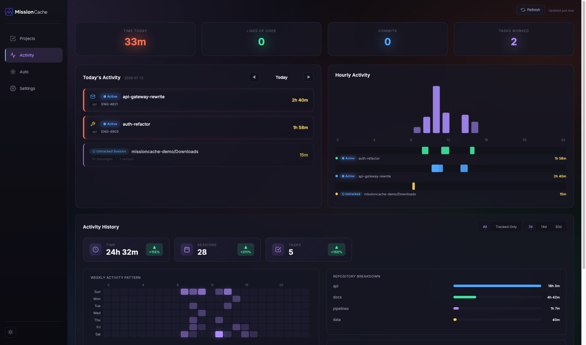

<p align="center">
  <picture>
    <source media="(prefers-color-scheme: dark)" srcset="assets/missioncache_logo_white.png">
    <source media="(prefers-color-scheme: light)" srcset="assets/missioncache_logo_black.png">
    
  </picture>
</p>

<h1 align="center">MissionCache</h1>

<p align="center"><strong>One workbench for your AI coding projects.</strong></p>

<p align="center"><em>Plan, execute, track, and resume - without losing state.</em></p>

<p align="center">
  
  
  
</p>

---

MissionCache is the project layer for AI coding tools. It works in [Claude Code](https://claude.ai/code), [Codex](https://github.com/openai/codex), [OpenCode](https://opencode.ai/), and VSCode Copilot Chat - any tool that speaks MCP. Every missioncache project gets a durable home: a plan, a living context file, and a task checklist. That state persists across sessions, survives context compaction, and reloads when you come back. On the Claude Code side, missioncache also adds time tracking, a local analytics dashboard, autonomous execution, and a rich statusline; the other three currently get the project state and the MCP tool suite.

<!-- HERO GIF: dashboard + statusline + /missioncache:new flow -->

## Contents

- [Why MissionCache](#why-missioncache)
- [Supported tools](#supported-tools)
- [Install](#install)
- [Your First Project](#your-first-project)
- [Features](#features)
- [When to use something else](#when-to-use-something-else)
- [Architecture](#architecture)
- [Commands](#commands)
- [Documentation](#documentation)
- [Contributing](#contributing)
- [License](#license)
- [Credits](#credits)

## Why MissionCache

### Your projects keep their memory

Every missioncache project lives under `~/.missioncache/active/<project-name>/` as three markdown files: `<project-name>-plan.md` (the agreed approach, locked after approval), `<project-name>-context.md` (your decisions, key files, gotchas, and next steps as a living document), and `<project-name>-tasks.md` (a hierarchical checklist with progress). Sessions end, context windows compact, but your project state stays put. Run `/missioncache:load <project-name>` in any new Claude Code session (`$missioncache-load` in Codex, `/missioncache-load` in OpenCode or VSCode) and missioncache reloads the full state. You pick up where you left off with your plan, your decisions, and your next steps already loaded.

### Full visibility into your Claude time

MissionCache tracks heartbeats while you work, aggregates them into sessions, and shows per-project, per-repo, per-day, and per-week breakdowns on a local web dashboard at `localhost:8787`. It merges missioncache's own heartbeat data with Claude Code's JSONL session logs, so the picture includes time you spent in Claude sessions that were not formally tracked. You always know which projects are actually eating your cycles.

### Autonomous execution you can watch live

MissionCache Auto runs project tasks in parallel with dependency-aware DAG scheduling, logs every iteration in real time, and streams execution state to the dashboard. You can watch the whole run as it happens or walk away and check the iteration log afterward. Every task, every attempt, every outcome is visible.

### One lead session that keeps every other session in view

When you run several Claude Code sessions at once, one per project, nobody sees the whole picture. Run `/missioncache:lead` in one session and it becomes the lead: it opens with a brief across all your projects (what is urgent, what is waiting on someone, which sessions are live, and today's calendar if you connect one), and from then on every other session tells it when its project changes. You check one window instead of six. If you want, the lead keeps the brief current on a schedule you choose, such as every 30 minutes for the next 7 hours. It only starts that loop when you ask, and it always stops at the end of the window.

---

MissionCache exists because no single existing tool integrates all of this. See [docs/comparison.md](docs/comparison.md) for the honest breakdown against the current field.

## Supported tools

The installer detects the AI tools you have and asks, per tool, whether to register MissionCache. The project files, the MCP server and the commands are the same everywhere. Only the way you type a command differs.

| Tool | Project files + MCP tools | Commands | Lead, hooks, statusline, dashboard, auto |
|------|---------------------------|----------|------------------------------------------|
| Claude Code | yes | `/missioncache:load`, `/missioncache:save`, ... | yes |
| Codex CLI | yes | `$missioncache-load`, `$missioncache-save`, ... (native skills) | no |
| OpenCode | yes | `/missioncache-load`, `/missioncache-save`, ... | no |
| VSCode (Copilot Chat) | yes | `/missioncache-load`, `/missioncache-save`, ... (macOS) | no |

Every command except `/missioncache:lead` ships to all four tools. The lead needs Claude Code's session titles and cross-session messaging. How each tool is registered, and how to skip the commands for one of them, is in [docs/installation.md](docs/installation.md#other-tools-codex-opencode-vscode).

## Install

MissionCache ships in two flavors. Pick based on whether you want the full workbench experience (recommended) or just the plugin core.

### Full install (recommended)

One command, no clone needed:

```bash
uvx missioncache-install
# or
pipx run missioncache-install
```

The interactive wizard asks which components to install (default is all) and sets up:

1. The missioncache plugin itself (slash commands, MCP server, hooks, rules)
2. The local dashboard at `localhost:8787` as a background service (launchd on macOS, systemd on Linux)
3. The `missioncache-auto` CLI for autonomous execution
4. The `missioncache-statusline` entry point, wired into `~/.claude/settings.json`
5. MissionCache rule files under `~/.claude/rules/`
6. The `/whats-new` and `/optimize-prompt` user-level slash commands under `~/.claude/commands/`

For a fully non-interactive install, use `uvx missioncache-install --all --yes`. To install everything except specific components, combine `--all` with opt-outs (e.g. `uvx missioncache-install --all --yes --no-statusline`). Opt-out flags on their own drop you into the interactive wizard; they only take effect alongside `--all` or explicit opt-ins.

**Requirements:** Python 3.11+, Claude Code CLI, and `uv` on your `PATH` (provides `uvx`). If `uvx --version` fails, install `uv` first with `pip install uv` or `curl -LsSf https://astral.sh/uv/install.sh | sh`. `pipx` works in place of `uvx` if you prefer.

**Windows note:** MissionCache runs on native Windows (no WSL). The installer registers the plugin, installs `missioncache-auto`, and registers the dashboard as a Task Scheduler task (falling back to an HKCU Run-key entry when run without elevation). The lifecycle hooks - including the pre-compaction snapshot and session tracking - run too: they launch through `uv` in exec form and the snapshot lock uses `msvcrt` on Windows. This requires **Claude Code 2.1.139+** (where hook exec form was added); an older client silently ignores it and the hooks will not run.

### Plugin-only install

If you only want the plugin core (slash commands, MCP tools, lifecycle hooks, missioncache rules) and don't need the dashboard, `missioncache-auto` CLI, or statusline, install MissionCache as a pure Claude Code plugin via the marketplace.

In Claude Code:

```
/plugin marketplace add missioncache/missioncache
/plugin install missioncache@missioncache
```

Restart your Claude Code session.

**Requirements:** Claude Code with `uvx` available on `PATH`. If `uvx --version` fails, install `uv` first with `pip install uv` or `curl -LsSf https://astral.sh/uv/install.sh | sh`. The MCP server and bundled `missioncache-db` are built on demand; no manual `pip install` is needed.

**What you give up with the plugin-only install:** no local dashboard at `localhost:8787`, no `missioncache-auto` CLI for parallel execution, no rich statusline. You keep everything else: per-project plan/context/tasks files, `/missioncache:load` resume, time heartbeat tracking in `~/.missioncache/tasks.db`, and every MCP tool.

### Updating later

```bash
uvx missioncache-install --update        # full install
```

Plugin-only: `/plugin update missioncache@missioncache` in Claude Code, then restart the session. Details, including the `uvx` cache trap, in [docs/installation.md](docs/installation.md#upgrading).

### Other tools (Codex, OpenCode, VSCode)

The full installer also registers missioncache in any non-Claude tool it detects. See [Supported tools](#supported-tools) above for the per-tool registration mechanics. The MCP server and commands are the same files missioncache ships to Claude. Only the invocation token differs: `/missioncache:load` in Claude Code, `$missioncache-load` in Codex, `/missioncache-load` in OpenCode and VSCode.

## Your First Project

### Create it

```
/missioncache:new auth-refactor
```

MissionCache drops three files under `~/.missioncache/active/auth-refactor/`:

```
auth-refactor-plan.md      # the agreed approach, locked after you approve
auth-refactor-context.md   # living notes: decisions, key files, gotchas, next steps
auth-refactor-tasks.md     # checklist with hierarchical subtasks
```

Claude walks you through a clarifying conversation, proposes a plan, and asks for approval. Once approved, the plan file is locked and the context file starts tracking your real progress.

<!-- SCREENSHOT: /missioncache:new interactive flow with file tree -->

### Work on it

Edit files, run tests, make decisions. MissionCache tracks time in the background via heartbeats. When Claude Code compacts the context window, missioncache's `PreCompact` hook auto-saves your current state so nothing gets lost.

If you want to checkpoint manually at any point:

```
/missioncache:save
```

### Resume it tomorrow

```
/missioncache:load auth-refactor
```

MissionCache reloads the plan, context, and tasks files and shows you:

- Where you left off (from the context file's "Next Steps" section)
- Progress (X/Y tasks complete)
- Key architectural decisions you made
- Any gotchas you flagged

You pick up without reconstructing anything.

<!-- SCREENSHOT: /missioncache:load output showing reload summary -->

### Run it autonomously

*Requires the full install (`uvx missioncache-install`). If you picked the plugin-only install, skip to "Finish it".*

If your tasks are decomposed enough, hand the whole project to MissionCache Auto:

```bash
missioncache-auto auth-refactor              # parallel, 8 workers (default)
missioncache-auto auth-refactor -w 12        # 12 workers
missioncache-auto auth-refactor --sequential # one task at a time
missioncache-auto auth-refactor --dry-run    # show execution plan without running
```

Auto runs each task in a separate Claude Code invocation, respects task dependencies, and streams iteration events to the dashboard. On a git repo, parallel runs give each worker its own git worktree and branch by default (merged back when the run finishes); pass `--no-worktree` to share one checkout.


### Finish it

```
/missioncache:done auth-refactor
```

MissionCache archives the project files to `~/.missioncache/completed/` and records the final time and progress stats.

That is the full lifecycle. Everything else is optional depth.

## Features

### Structured project files

Every project has three markdown files: `<project-name>-plan.md`, `<project-name>-context.md`, and `<project-name>-tasks.md`. They live under `~/.missioncache/active/<project-name>/` and are fully human-editable. Plan captures the agreed approach and locks after approval. Context is a living document for decisions, key files, gotchas, and next steps. Tasks is a hierarchical checklist with per-item progress tracking.

Removing content is a tool call too. `update_context_file` takes `sections_remove` (whole sections) and `bullets_remove` (one list item or table row), and `update_tasks_file` takes `tasks_remove`, which records the task under `## Removed` with a reason instead of leaving it to skew the progress count. When content belongs in another project, `move_to_project` moves sections, bullets, tasks and Waiting-on rows between two projects in one locked operation, so a split cannot half-apply.

<!-- SCREENSHOT: example tasks.md with checkboxes and phases -->

### Context preservation across compaction

MissionCache's `PreCompact` hook auto-saves project state before Claude Code compacts the context window. When you run `/missioncache:load` in a new session, the full state reloads. You never reconstruct your mental model from scratch, and you never lose a decision you made three sessions ago.

If a context file gets damaged (duplicate sections, or Recent Changes entries stranded outside their section), `missioncache-db repair` fixes it. It is a dry run by default and writes only with `--apply`. See the [CLI reference](docs/cli.md#repairing-a-damaged-context-file).

### Forks: a shared context layer under a parent project

A fork is a full project with a parent. It gets its own plan, task list and clock, but it reads the parent's context file as a shared layer, so the architecture and the gotchas are written once and every lane sees them. Sibling sessions are told when the shared layer changes. Use it when two efforts share one base, like a pipeline with a test layer per product. [docs/forks.md](docs/forks.md) has the decision test and a worked example.

### Local analytics dashboard

A FastAPI + vanilla JS single-page app at `localhost:8787`. It opens on the **Attention** view: what you owe (your action items plus the Waiting-on rows that name you), who owes you what grouped by how long it has been quiet, and every project with something outstanding, each with its next step, or what you last did when there is none. The rest shows active and completed projects with time tracking, per-repo breakdowns, hourly heatmaps, a weekly activity view, MissionCache Auto execution monitoring with DAG visualization, and untracked Claude Code sessions alongside the tracked ones. Dual-database under the hood: SQLite for writes, DuckDB for analytics reads.




### A lead session across all your open sessions

`/missioncache:brief` gives you one view across every project: urgent items, overdue action items, Waiting-on rows that have gone quiet, live sessions, and today's schedule. `--delta` shows only what changed since the last brief.

`/missioncache:lead` makes one Claude Code session the lead. Every write tool that changes a project's files tells the writing session who the lead is, and that session sends the lead a one-line notice, so the lead learns about each change as it happens instead of rereading every project. The lead holds the notices and folds them into its next brief rather than interrupting you. It is not bound to any project. Designating a new lead replaces the old one, and `/missioncache:lead stop` ends the role.

The recurring brief is opt-in. After the first brief the lead asks how often to check (every 15 minutes, 30 minutes, an hour, another interval, or not at all) and for how long, 7 hours by default. The loop ends at that time on its own. After a compaction or resume the loop is gone, and the lead offers to restart it rather than restarting it silently. The lead needs Claude Code, because it relies on cross-session messaging. `/missioncache:brief` works in every supported tool.

### Autonomous execution with MissionCache Auto

A standalone CLI that runs a project's tasks to completion in parallel. DAG scheduling respects task dependencies so dependent work waits for its prerequisites. Default eight workers, configurable with `-w N` or `--sequential`. Every iteration is logged with a timestamp, the task, the agent that ran it, and the outcome, and streamed live to the dashboard.


### Rich multi-line statusline

An optional terminal display showing the active project with progress fraction, git branch and status, Claude model, context usage, API limits, and last action time. OSC 8 hyperlinks open directly into the dashboard's project view from your terminal. Configurable, dark-mode friendly, low-latency.


### A full MCP tool suite for Claude

MissionCache's MCP server exposes tools across seven modules: task lifecycle, documentation and file operations, time tracking, iteration logging, planning, the active-project pointer, and project management (action items, stakeholders, tickets, due dates). Claude uses them automatically during `/missioncache:new`, `/missioncache:load`, and other commands, but you can call any of them directly if you want fine-grained control.

### Lifecycle hooks

Six Claude Code hooks across four events tie missioncache directly into the session lifecycle, and they are what makes "resume tomorrow" actually work. `SessionStart` auto-detects the active project as soon as you open a terminal. `PreCompact` auto-saves your context before Claude Code compacts the window, so nothing gets lost on long sessions. `Stop` reminds you to run `/missioncache:save` if you edited project files without saving. Three `UserPromptSubmit` hooks run on every prompt: one records the activity heartbeats that power time tracking, one reminds you when task tracking drifts, and one names the session after its project, so other sessions and the lead can send it messages. All six ship with the plugin.

## When to use something else

MissionCache is not the right answer for every workflow.

- **PRD to task decomposition across many IDEs:** [Taskmaster AI](https://github.com/eyaltoledano/claude-task-master)
- **Memory that outlives any single project:** [claude-mem](https://github.com/thedotmack/claude-mem) or [MemPalace](https://www.mempalace.tech/)
- **A fresh context for every task:** [GSD / GSD-2](https://github.com/gsd-build/get-shit-done)
- **A methodology that enforces TDD:** [Superpowers](https://github.com/obra/superpowers), which works inside a MissionCache project
- **Zero-install multi-session orchestration with no state between runs:** [Claude Code Agent Teams](https://code.claude.com/docs/en/agent-teams)

The full comparison tables, with where each tool beats MissionCache, are in [docs/comparison.md](docs/comparison.md).

## Architecture

MissionCache's load-bearing piece is the `mcp-missioncache` MCP server. Around it sit six standalone components you can install or skip independently:

| Component | Purpose | Installs via |
|---|---|---|
| `mcp-missioncache` | MCP server (project state, file ops, time tracking, iteration logging) | Bundled with the Claude plugin; `pipx install mcp-missioncache` for other tools |
| `missioncache` Claude plugin | Slash commands as `/missioncache:*`, lifecycle hooks (SessionStart, PreCompact, Stop, UserPromptSubmit), rules | Claude Code plugin marketplace |
| `missioncache-db` | SQLite layer at `~/.missioncache/tasks.db` | `pip install missioncache-db` |
| `missioncache-auto` | Autonomous execution CLI (Claude Code only) | `pip install missioncache-auto` |
| `missioncache-dashboard` | Local FastAPI + vanilla JS web UI at `localhost:8787`, DuckDB analytics layer (Claude Code only) | Runs as a launchd/systemd service |
| `missioncache-statusline` | Optional multi-line terminal display (Claude Code only) | Bundled with `missioncache-dashboard`, wired into `~/.claude/settings.json` |
| `missioncache-extension` | VSCode / Cursor extension: status bar with the active project and progress, sidebar with tasks, Next Steps and Waiting on (Claude Code not required, reads through the `missioncache-db` CLI) | Open VSX and VS Marketplace (not published yet), or the `.vsix` from the repo |

<!-- DIAGRAM: plugin + MCP server + db + auto + dashboard + statusline component graph -->

The MCP server plus `missioncache-db` is the minimum viable install (and the only piece needed for Codex / OpenCode / VSCode). Everything else is opt-in, and each component can be used on its own if you only need that piece. `missioncache-db` and `missioncache-auto` are pip-installable packages you can depend on from your own scripts.

### Data storage

| Path | Purpose |
|---|---|
| `~/.missioncache/active/` | Active project files (plan, context, tasks) |
| `~/.missioncache/completed/` | Archived completed projects |
| `~/.missioncache/tasks.db` | SQLite database (task tracking, time heartbeats, Claude session cache) |
| `~/.missioncache/tasks.duckdb` | DuckDB analytics (synced from SQLite, dashboard reads) |
| `~/.missioncache/update-check.json` | Cached result of the update check |

### What MissionCache writes and connects to

Everything MissionCache stores stays on your machine. There is no account, no telemetry and no MissionCache server.

**Files outside `~/.missioncache/`:**

- `~/.claude/rules/`: the `SessionStart` hook copies the plugin's rule file there, so Claude follows the MissionCache conventions. It only updates files that carry the plugin's ownership marker on the first line. Remove the marker from your copy and the hook leaves it alone.
- `~/.claude/hooks-state.db`: a small SQLite file with per-session state (which project each session is bound to, context usage for the statusline, terminal-to-session mapping).
- `~/.claude/hooks/state/`: small pointer files the hooks use to find the current session.
- With the full install: a dashboard service (launchd on macOS, systemd on Linux, Task Scheduler on Windows) and, if you choose the statusline, a `statusLine` entry in `~/.claude/settings.json`.

**What runs and what it connects to:**

- The MCP server starts through `uvx` from the plugin directory. On first launch `uv` downloads its Python dependencies from PyPI.
- The dashboard listens on `127.0.0.1:8787` only, never on an external interface.
- The update check asks `pypi.org` for the latest MissionCache versions and caches the answer.
- The statusline reads `status.claude.com` to show Claude incidents. You can turn it off in the dashboard's statusline settings.
- Hooks run on session start, before compaction, at the end of each turn, and on every prompt. They read and write only the paths above.

## Commands

| Command | Description |
|---------|-------------|
| `/missioncache:new` | Create a new project with plan, context, and task files |
| `/missioncache:fork` | Create a project as a fork of an existing parent, sharing the parent's context as a common knowledge layer |
| `/missioncache:load` | Resume work on an active project |
| `/missioncache:save` | Persist progress before session end or compaction |
| `/missioncache:done` | Mark a project as completed and archive |
| `/missioncache:rename` | Rename the current project |
| `/missioncache:prompts` | Regenerate optimized prompts for subtasks |
| `/missioncache:mode` | Assign workflow mode (interactive or autonomous) to tasks |
| `/missioncache:brief` | Cross-project brief: what is urgent, what is waiting, which sessions are live, and a schedule for today |
| `/missioncache:lead` | Designate this session as the project-manager lead that keeps the brief live, or `stop` the role |

## Documentation

Deep dives for each component live in `docs/`:

- [**Installation**](docs/installation.md) - all three install paths (`uvx missioncache-install`, marketplace, manual), verification, uninstall, troubleshooting
- [**Architecture**](docs/architecture.md) - component boundaries, database schema, extension points
- [**Dashboard**](docs/dashboard.md) - screens, time accounting, API reference, customization
- [**Forks**](docs/forks.md) - when to fork, the shared context layer, the `Fork of:` header, parallel-session freshness
- [**MissionCache Auto**](docs/missioncache-auto.md) - sequential vs parallel, DAG scheduling, learning tags, worker model, review stages
- [**MCP Tools**](docs/mcp-tools.md) - all 44 tools by module, error handling, extension patterns
- [**CLI**](docs/cli.md) - the CLI-only operations: cross-machine export/import with the per-machine path map, tag keywords, prune/cleanup, bulk repo registration
- [**Statusline**](docs/statusline.md) - lines explained, env vars, customization, performance notes
- [**Hooks**](docs/hooks.md) - SessionStart, UserPromptSubmit, PreCompact, Stop, state files, adding new hooks
- [**Editor extension**](docs/extension.md) - status bar and sidebar for VSCode and Cursor
- [**Comparison**](docs/comparison.md) - MissionCache against Taskmaster, claude-mem, MemPalace, GSD, Superpowers and Claude Code's native features, misses included

## Contributing

Pull requests welcome. See [CONTRIBUTING.md](CONTRIBUTING.md) for development setup (`uvx missioncache-install --local`), testing conventions, and PR standards.

## License

MIT. See [`LICENSE`](LICENSE).

## Credits

MissionCache stands on the shoulders of the tools that came before it. Direct inspiration and honest competition: [GSD](https://github.com/gsd-build/get-shit-done), [claude-mem](https://github.com/thedotmack/claude-mem), [MemPalace](https://www.mempalace.tech/), [Taskmaster AI](https://github.com/eyaltoledano/claude-task-master), [Superpowers](https://github.com/obra/superpowers), and the [Anthropic Productivity Plugin](https://claude.com/plugins/productivity). Each of them solves a real slice of the multi-session Claude Code problem, and missioncache would not exist without the paths they blazed.
