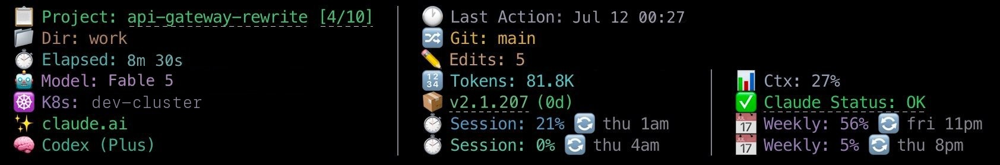

# Statusline

A block of lines at the bottom of Claude Code that shows your project, git, model, context use and usage limits.



The full install turns it on. It refreshes on every Claude Code prompt.

## What each line shows

| Line | What you see |
|---|---|
| **Project** | The loaded project and its progress (`[3/8]`, or `[TBD]` with no real tasks yet), when its context was saved, `⤵ Fork of: <parent>` on a fork (with the parent's own parent in gray when the parent is a fork too), and your last prompt time. |
| **Location** | The folder, the git branch (green when clean, yellow when there are changes), and the open PR for the branch. |
| **Session** | How long this session has run, and how many edits Claude made. |
| **Metrics** | The model, the effort level, and `Fast mode activated` when fast mode is on. |
| **Context** | Your kubectl context (only if `kubectl` is installed), tokens used, and how full the context window is. |
| **Usage** | Your plan, session and weekly usage with reset times, any per-model weekly limit, and extra credits spent. |
| **Codex** | Codex plan and usage. Only when Codex is installed. |
| **Vitals** | Your Claude Code version and any newer one, `MissionCache update available` when there is one, and Claude's service status. |

The block keeps a fixed height: 7 lines, 8 with Codex, plus your addon rows.

**Context colours.** From 65% it turns yellow with `Compact recommended`, and from 80% red with `Compact now!`. `(Estimated)` means Claude Code did not send the number, so it was worked out from token counts.

**Version colour.** Green means you have read the release notes for this version with `/whats-new`. Yellow means you have not.

**Links.** Click the project name for the dashboard, the progress for the project's tasks, and the saved time for its context. The PR number, version and status open the PR, the Claude Code changelog and status.claude.com.

## Turn it on or off

```bash
uvx missioncache-install --statusline              # turn it on
uvx missioncache-install --uninstall statusline    # turn it off
uvx missioncache-install --all --no-statusline     # install everything else
uvx missioncache-install --update                  # get the newest version
```

The statusline comes with the dashboard package, so `--statusline` adds the dashboard when it is missing.

If Claude Code already has a statusline, the installer asks before replacing it and saves the old setting to `~/.claude/settings.json.bak`. An `--update` never replaces a statusline you set yourself.

## Choose what it shows

Open the dashboard, click **Settings**, then the **Statusline** tab. Click **Save statusline settings**, and the next prompt shows the change.

| Setting | Controls |
|---|---|
| Codex usage | The Codex line. |
| Claude subscription usage | The usage numbers. |
| Claude subscription type | The plan name. |
| Claude status | The service status. |
| Services to monitor | Which Claude services count. `Code` and `Claude API` by default. |
| Show model suspension / deprecation notices | Model-access notices in the status. Off by default. Real outages always show. |
| Put addon rows below the Claude status line | Where addon rows sit. Off by default, so status stays last. |

## Environment variables

Set these in your shell profile, then restart Claude Code.

| Variable | Default | What it does |
|---|---|---|
| `MISSIONCACHE_DASHBOARD_URL` | `http://localhost:8787` | Where the links point. Set it if your dashboard runs on another port. |
| `NO_COLOR` | unset | Any value turns colours off. |
| `MISSIONCACHE_STATUSLINE_DEBUG` | unset | Any value writes what Claude Code sent to `~/.claude/hooks/state/statusline-ctx-debug.log` on every refresh. |

## Add your own cells

An addon is a cell filled by a command you choose. Add one in **Settings**, **Statusline** tab, under **Statusline addons**. **+ Add example** fills in one to start from.

This one shows a number a scheduled job writes to a file:

```json
{
  "id": "deploys",
  "enabled": true,
  "label": "Deploys",
  "icon": "🚀",
  "color": "version",
  "command": ["/bin/cat", "/Users/you/.cache/deploys.json"],
  "ttl": 60,
  "timeout": 5
}
```

- `id`: lowercase letters, digits and hyphens, up to 32 characters.
- `command`: runs with no shell. The first item must be a full path to a file that exists. Add only commands you trust.
- `ttl`: seconds the last result is reused, 5 or more. `timeout`: 1 to 30 seconds.
- `placement` (optional, own line by default): `"row"` gives the addon its own line, shared with addons of the same `group`. `"append"` adds the cell to the built-in line named in `target`: `location`, `project`, `metrics`, `session`, `context`, `usage`, `codex` or `vitals`.

The command prints plain text, or JSON like `{"value": "3", "color": "health_ok"}` that can also set `label`, `icon` or `"hidden": true`. An addon that fails or prints nothing leaves its line blank. Keep it fast. For slow data, have a cron or launchd job write a file and read it, as above.

## On Windows

- The installer writes the full path to `missioncache-statusline`, in quotes when it has a space.
- If the installer warns that `missioncache-statusline` is not on PATH yet, restart your shell and run `uvx missioncache-install --statusline` again.
- If an update says the dashboard is still running and skips the upgrade, stop those processes or restart, then run `uvx missioncache-install --update`.

## When something looks wrong

**No statusline at all.** Run `which missioncache-statusline`. If it prints nothing, run `uvx missioncache-install --statusline`. `statusLine.command` in `~/.claude/settings.json` should be `missioncache-statusline` (on Windows, the full path). Test it with `echo '{}' | missioncache-statusline`. Errors go to `~/.claude/logs/statusline-errors.log`.

**The project is missing.** Run `/missioncache:load <project>` in that session.

**Edits stays at 0.** The count comes through the dashboard. Run `missioncache-dashboard status` and start it if it is not running.

**A line stays blank.** Set `MISSIONCACHE_STATUSLINE_DEBUG=1` and read the debug log to see what Claude Code sent.

**The version is yellow.** Run `/whats-new`. It ships with `uvx missioncache-install --user-commands`.

**A setting did not change anything.** Click **Save statusline settings** in the dashboard, then send a prompt. For an environment variable, restart Claude Code from a new terminal.

## More

How it renders, what it caches, and how to change the built-in lines: [internals/statusline.md](internals/statusline.md).
